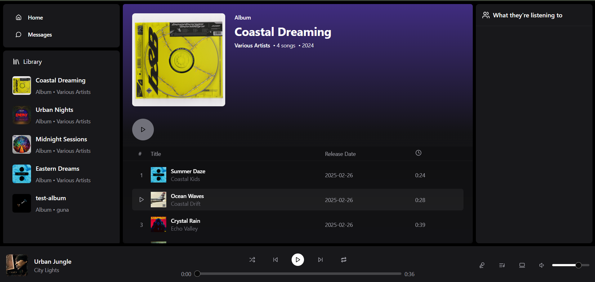

# my-music (Fullstack Music Web App)

A feature-rich music streaming platform built with MERN stack and Socket.io, allowing users to stream songs, chat in real time, and manage playlists.

[](https://my-music-v1.vercel.app)

---

## Live Site

https://my-music-v1.vercel.app  

Backend API: https://my-music-backend.onrender.com

---

## UI

### 🔹 Home Page


### 🔹 Real-Time Chat & User Activity


### 🔹 Admin Dashboard


### 🔹 Upload Interface


### 🔹 Album View


---

## Features

- Stream music with real-time queue and playback
- Live user activity + chat (Socket.io)
- Admin dashboard to upload/remove albums & songs
- Volume control, queue management, auto-next
- Google OAuth login

---

## Tech Stack

- **Frontend**: React.js, TailwindCSS, Zustand, Socket.io-client
- **Backend**: Node.js, Express.js, MongoDB
- **Storage**: Cloudinary (moving to AWS S3)
- **Auth**: Google OAuth
- **Deployment**: Vercel (frontend), Render (backend)

---

## Getting Started

```bash
# frontend
git clone https://github.com/Guna1301/my-music
cd frontend
npm install
npm run dev

# backend

cd backend
npm install
npm run dev
```
> ⚠️ **Make sure to set environment variables** in both frontend and backend before running the app locally:
> 
> - `REACT_APP_BACKEND_URL` in frontend
> - `CLOUDINARY_API_KEY`, `CLOUDINARY_SECRET`, `GOOGLE_CLIENT_ID`, `GOOGLE_CLIENT_SECRET`, etc., in backend

---

## Folder Structure (Simplified)

```bash
my-music/
├── frontend/              # React frontend
│   ├── src/
│   ├── public/
│   └── vercel.json
├── backend/             # Node.js backend
│   ├── routes/
│   ├── controllers/
│   ├── models/
│   └── .env
└── screenshots/         # Images for README
```
---

## Future Plans

- ✅ Recommendation engine based on user activity  
- ✅ Switch file storage to AWS S3  
- ⏳ Add user-created playlists  
- ⏳ Add search & filters by genre/artist  
- ⏳ Mobile responsiveness polish  
- ⏳ User profiles and listening history  

---


Built by **me**  
Feel free to reach out via [Twitter](https://x.com/gs_1305) or [Portfolio](https://guna-me.vercel.app/)

---

## Acknowledgements

- UI inspired by Spotify & YouTube Music  
- Special thanks to ChatGPT for suggestions during development 😄
